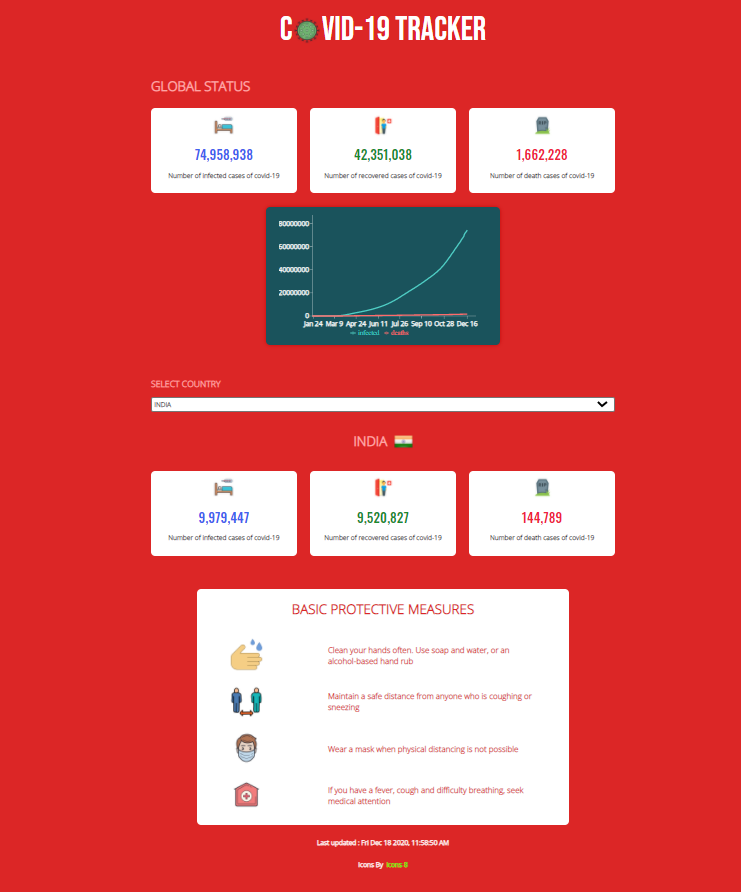

# COVID-19 TRACKER

The aim of this web application is to spread awareness about COVID-19 pandemic. It provides statistics of COVID-19 cases for global as well as for countries using [mathdroid](https://github.com/mathdroid/covid-19-api) api.

[Live Demo](https://covid19trackerbyshikhar.netlify.app/)

